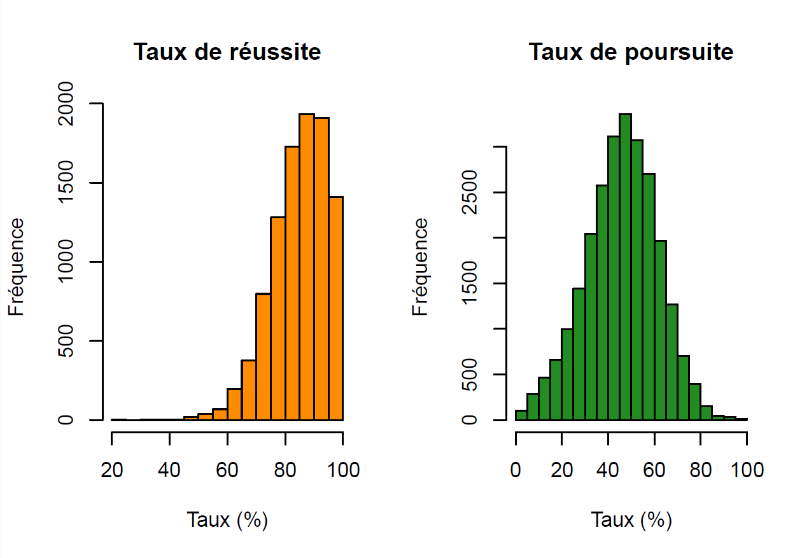
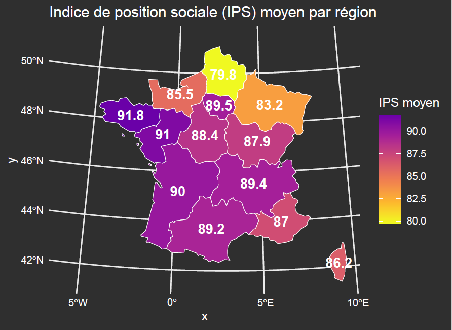
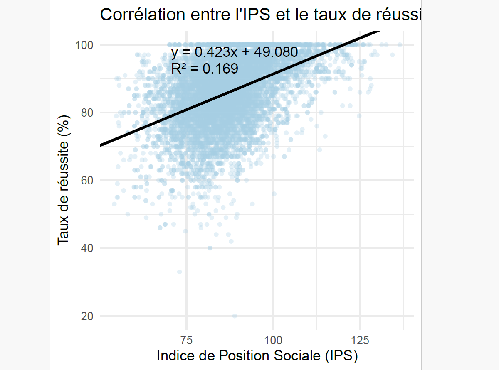
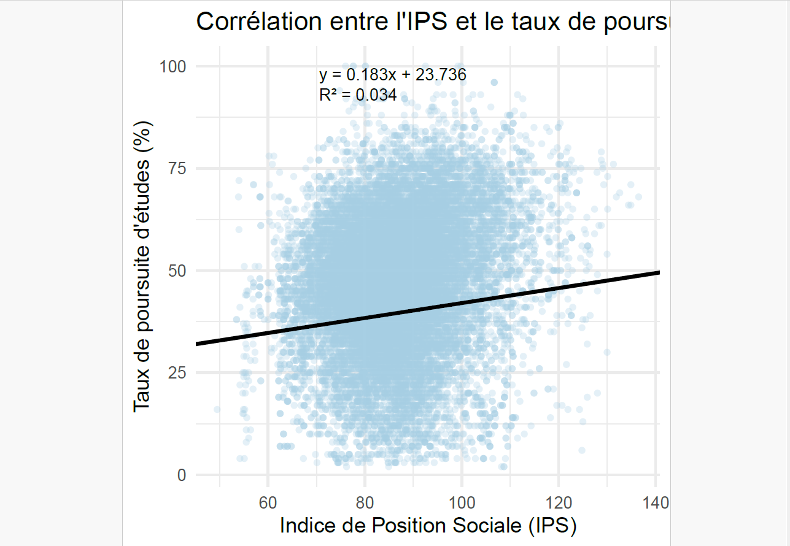

# 📊 Statistical Analysis of Academic Performance

## 📌 Project Overview

This project presents a comprehensive statistical analysis of academic performance using R.

The main objective is to explore the relationship between the Social Position Index (IPS) and student success indicators, identify socio-economic disparities, and provide data-driven insights through statistical modeling and visualization.

---

# 📂 Dataset Description

The dataset includes:

- Social Position Index (IPS)
- Success rate (%)
- Continuation rate (%)
- Regional information

These variables allow us to analyze socio-economic influence on academic outcomes.

---

# 🛠 Methods Used

- 📈 Descriptive statistics
- 🔗 Correlation analysis
- 📉 Linear regression modeling
- 📊 Data visualization (ggplot2)
- 🗺 Spatial visualization (regional analysis)

---

# 📊 Descriptive Statistics

Before applying statistical models, we explored the distribution of key variables.

The histograms below illustrate:

- Distribution of success rate
- Distribution of continuation rate
- Overall spread and central tendencies

---

# 🗺 Geographic Distribution of IPS

The map below presents the average Social Position Index (IPS) across French regions.

This visualization highlights regional socio-economic disparities and spatial inequality patterns.

---

# 📦 IPS Categories & Academic Success

To better understand inequality patterns, IPS values were categorized (Low / Medium / High) and compared using boxplot visualization.

Key observations:

- Higher IPS categories show higher median success rates.
- Distribution spread differs across categories.
- Presence of outliers suggests variability within groups.

---

# 📉 Linear Regression Analysis

A linear regression model was applied to evaluate the relationship between IPS and academic success rate.

Example model:

y = 0.423x + 49.080  
R² = 0.169  

Interpretation:

- Positive relationship between IPS and success rate.
- IPS explains part of the variability in academic performance.
- Academic success is influenced by additional socio-economic factors.

---

# 🔗 Correlation Analysis

Scatter plot visualization confirms a positive correlation between IPS and student performance.

Although the relationship exists, dispersion suggests that IPS is not the sole determinant of academic success.

---

# 📊 Key Insights

- Socio-economic position significantly influences academic outcomes.
- Regional disparities exist in IPS distribution.
- Academic performance is multi-factorial.
- Data visualization provides clear evidence of structural inequality patterns.

---

# 📁 Project Structure
